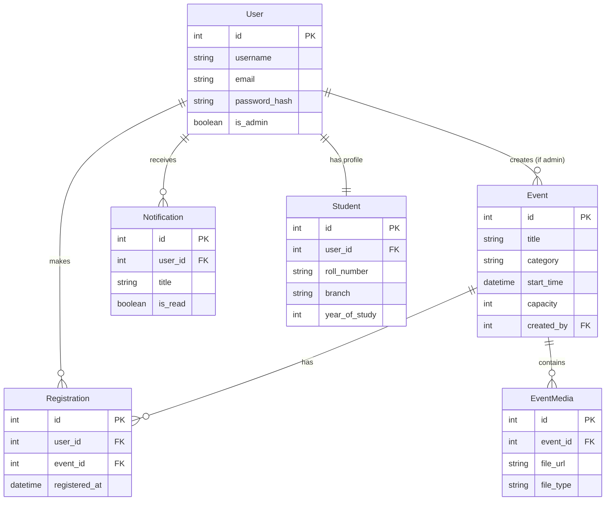
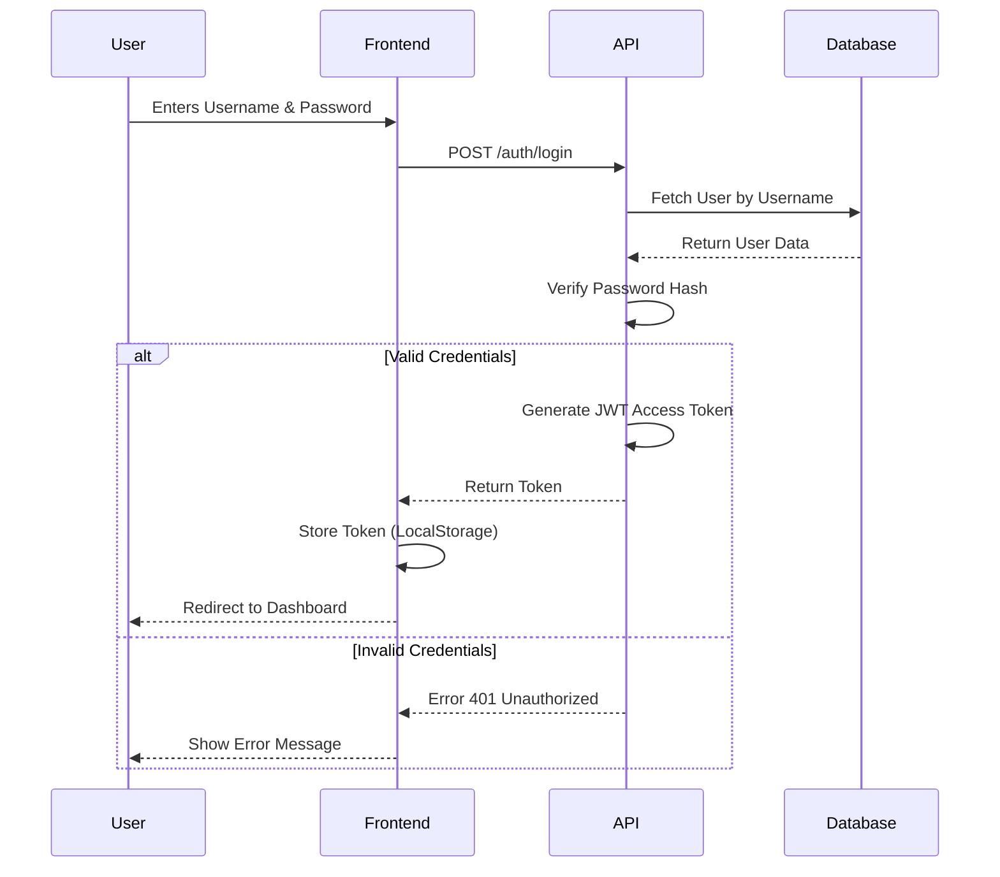

# Event Manager - Technical Documentation

## 1. Project Overview
The **Event Manager** is a full-stack web application designed to help colleges manage events, student registrations, and notifications. It features a robust **FastAPI** backend and a modern **React** frontend, providing role-based access for Administrators and Students.

## 2. Tech Stack & Tools Explained

| Component | Tool / Library | Why it was used? |
| :--- | :--- | :--- |
| **Backend Framework** | **FastAPI** | High performance, automatic API documentation (Swagger UI), and easy async support. Ideal for modern Python web APIs. |
| **Frontend Framework** | **React** | Component-based, efficient rendering, and a vast ecosystem. |
| **Language (Backend)** | **Python 3.10+** | Readable, powerful standard library, and excellent support for data processing. |
| **Language (Frontend)** | **TypeScript** | Adds static typing to JavaScript, reducing bugs and improving developer experience with auto-completion. |
| **Database** | **SQLAlchemy ORM** | Allows interacting with the database using Python classes instead of raw SQL. Support for SQLite (dev) and PostgreSQL (prod). |
| **Validation** | **Pydantic** | Used in FastAPI for strict data validation and serialization (converting data to JSON). |
| **Authentication** | **JWT (JSON Web Tokens)** | Stateless authentication mechanism. Securely transmits user identity between frontend and backend. |
| **Styling** | **MUI (Material UI)** | Provides pre-built, accessible, and beautiful UI components (layouts, inputs, buttons) to speed up development. |
| **Charting** | **Recharts** | (Planned/Recommended) Composable charting library for React to visualize data. |
| **Icons** | **Lucide React** | Modern, lightweight icon set for inconsistent UI design. |

---

## 3. Database Architecture

The application uses a relational database model. Below is the Entity-Relationship Diagram (ERD) showing how tables connect.



### Key Variations
- **One-to-One**: `User` <-> `Student`. Each user has exactly one student profile.
- **One-to-Many**: `User` <-> `Registration`. A user can register for multiple events.
- **One-to-Many**: `Event` <-> `Registration`. An event can have multiple users registering for it.

---

## 4. Application Logic & Flowcharts

### A. Authentication Flow
How a user logs in and gets access to protected routes.



### B. Event Registration Process
How a student registers for an event.

```mermaid
flowchart TD
    A[Student clicks 'Register'] --> B{Is User Logged In?}
    B -- No --> C[Redirect to Login]
    B -- Yes --> D{Is Event Full?}
    D -- Yes --> E[Show 'Event is Full' Msg]
    D -- No --> F{Already Registered?}
    F -- Yes --> G[Show 'Already Registered']
    F -- No --> H[Call API: POST /registrations]
    H --> I[Backend Validates Request]
    I --> J[Save Registration to DB]
    J --> K[Decrement Event Capacity (Virtual)]
    K --> L[Return Success Response]
    L --> M[Update UI to 'Registered']
```

---

## 5. Codebase Walkthrough & Tools

### Backend Structure (`app/`)

| File / Directory | Description | Tools Used |
| :--- | :--- | :--- |
| `main.py` | The entry point of the API. Sets up routes, middleware (CORS), and startup events. | `FastAPI` |
| `models.py` | Defines the database schema using Python classes. These map directly to SQL tables. | `SQLAlchemy` |
| `schemas.py` | Defines the shape of data requests (Pydantic models). Controls what JSON is sent/received including validation rules (e.g., email format). | `Pydantic` |
| `dependencies.py` | Contains helper functions for security, specifically dependency injection for retrieving the current user from a JWT token. | `python-jose`, `Passlib` |
| `routers/` | Splits the API into modules (e.g., `auth.py`, `events.py`, `registrations.py`) to keep code organized. | `APIRouter` |
| `database.py` | Handles the connection string and session management for the database. | `engine`, `SessionLocal` |

### Frontend Structure (`src/`)

| File / Directory | Description | Tools Used |
| :--- | :--- | :--- |
| `App.tsx` | The main component that defines the application routes (navigation) and theme. | `react-router-dom` |
| `context/AuthContext.tsx` | Manages the global state of the user (logged in/out). Wraps the app to provide user info to any page. | `React Context API` |
| `pages/` | Contains the views for each route. (e.g., `Home.tsx`, `EventList.tsx`, `Login.tsx`). | `MUI Components` |
| `services/api.ts` | A central place for making HTTP requests to the backend. Uses Axios interceptors to automatically attach the JWT token to headers. | `Axios` |

## 6. Detailed Explanation of "Why"

### Why FastAPI?
We chose **FastAPI** over Flask or Django because:
1.  **Speed**: It is one of the fastest Python frameworks available.
2.  **Type Safety**: It uses Python type hints heavily, which helps catch bugs early.
3.  **Auto-Docs**: It automatically generates Swagger UI documents at `/docs`, which is incredibly useful for testing endpoints without writing a separate frontend test.

### Why React + TypeScript?
**React** allows us to build a dynamic "Single Page Application" (SPA) where pages load instantly without refreshing the browser. **TypeScript** was added to ensure that the data coming from the API matches exactly what the frontend expects, preventing "undefined is not a function" errors.

### Why SQLAlchemy?
Writing raw SQL (e.g., `SELECT * FROM users WHERE...`) is error-prone and insecure (SQL Injection). **SQLAlchemy** allows us to write pythonic code like `db.query(User).filter(...)` which is safer, cleaner, and works across different databases (SQLite locally, PostgreSQL in production) without changing code.
