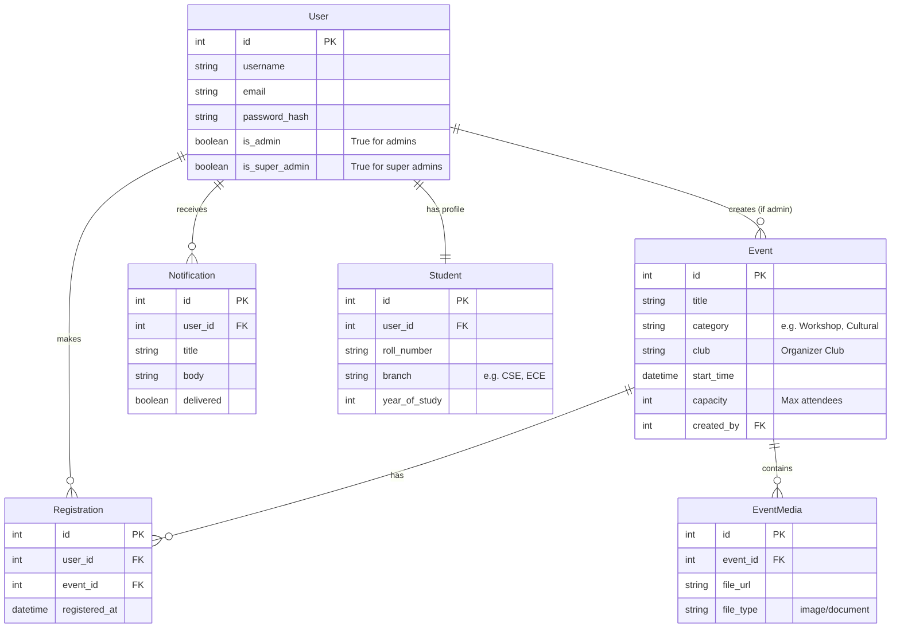
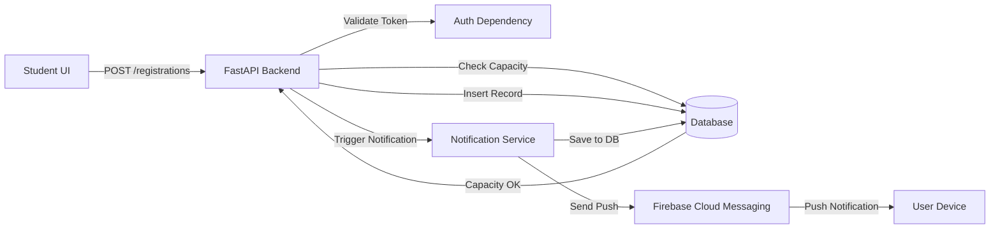
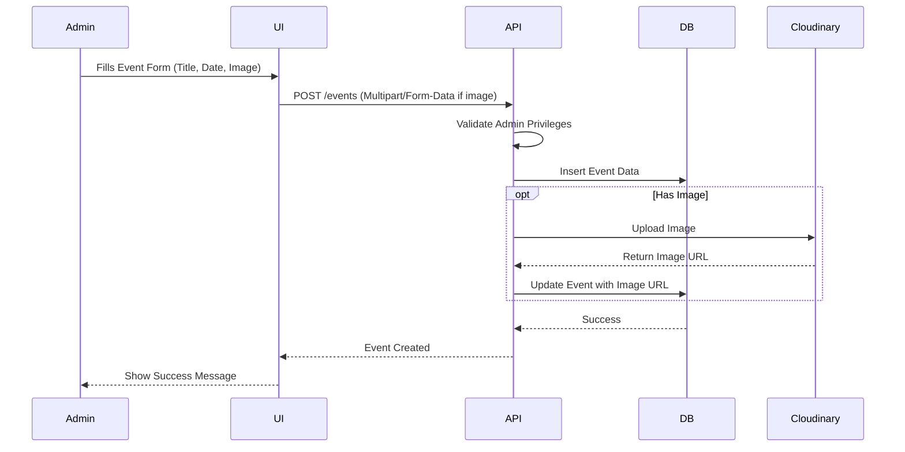

# Event Manager - Comprehensive Technical Documentation

## 1. Project Overview
The **Event Manager** is a full-stack web application designed to help colleges manage events, student registrations, and notifications. It features a robust **FastAPI (Python)** backend and a modern **React (TypeScript)** frontend.

---

## 2. Tech Stack & Tools

### Backend (`event-manager-api`)
| Tool / Library | Purpose |
| :--- | :--- |
| **FastAPI** | High-performance web framework for building APIs. |
| **SQLAlchemy** | ORM (Object Relational Mapper) to interact with the database using Python classes. |
| **Pydantic** | Data validation and settings management using Python type hints. |
| **Alembic** | Lightweight database migration tool for usage with SQLAlchemy. |
| **Python-Jose** | JavaScript Object Signing and Encryption implementation for handling JWTs. |
| **Passlib** | Password hashing library (using bcrypt) for secure authentication. |
| **Firebase Admin** | (Planned/Partially Implemented) For sending Push Notifications to devices. |
| **Uvicorn** | ASGI web server implementation for Python. |

### Frontend (`event-manager-ui`)
| Tool / Library | Purpose |
| :--- | :--- |
| **React** | Library for building user interfaces. |
| **TypeScript** | Superset of JavaScript adding static types. |
| **Vite / Create React App** | Build tool and development server. |
| **React Router DOM** | Declarative routing for React applications. |
| **MUI (Material UI)** | Component library for faster and easier web development. |
| **Axios** | Promise-based HTTP client for the browser to make API requests. |
| **Recharts** | (Planned) Composable charting library for React components. |
| **Framer Motion** | (Recommended) Library for animations. |

---

## 3. Architecture Diagrams

### A. Database Entity-Relationship Diagram (ERD)

### B. Application Flowcharts

#### 1. Registration Data Information Flow
How data moves when a student registers.

#### 2. Event Creation Flow (Admin)

---

## 4. Detailed Component & File Breakdown

### Backend Structure (`event-manager-api/app`)

| File / Folder | Component | Description |
| :--- | :--- | :--- |
| **root** | `main.py` | **Entry Point**: Initializes FastAPI app, CORS middleware, and includes all routers. |
| | `models.py` | **Database Schema**: Defines SQL tables (User, Event, Student, Registration, Notification). |
| | `schemas.py` | **Pydantic Models**: Defines Request/Response structures (e.g., `UserCreate`, `EventResponse`). |
| | `database.py` | **DB Config**: Sets up the database engine and session maker (`SessionLocal`). |
| | `dependencies.py` | **Auth Logic**: Functions like `get_current_user` that verify JWT tokens for protected routes. |
| | `config.py` | **Configuration**: Loads environment variables (DB URL, Secret Keys) using `BaseSettings`. |
| **routers/** | `auth.py` | Handles Login (`/auth/login`) and Signup (`/auth/signup`). Returns JWT tokens. |
| | `events.py` | CRUD operations for Events. Admins create/update/delete; Students list/view. |
| | `registrations.py` | Handles event registration (`POST /registrations`) and cancellation. |
| | `users.py` | User management endpoints (fetching profile, updating info). |
| | `notifications.py` | Management of user notifications (list, mark read). |
| | `analytics.py` | (New) API endpoints for dashboard statistics and charts. |
| **services/** | `notifications.py` | Business logic for creating notification records in the DB. |
| | `push.py` | (Stub) Logic for integrating with Firebase FCM for push notifications. |

### Frontend Structure (`event-manager-ui/src`)

| File / Folder | Component | Description |
| :--- | :--- | :--- |
| **root** | `App.tsx` | **Main Router**: Defines application routes (`/`, `/events`, `/login`) and protects them. |
| | `index.tsx` | **Entry Point**: Mounts the React app to the DOM and wraps it with Providers. |
| **pages/** | `Home.tsx` | Landing page. Shows upcoming events and quick insights. |
| | `Login.tsx` | User login form. Calls `authService.login`. |
| | `Signup.tsx` | Student registration form. Calls `authService.signup`. |
| | `EventList.tsx` | Displays a grid/list of all available events with filters. |
| | `EventDetails.tsx` | Detailed view of a single event. Shows description, venue, and "Register" button. |
| | `MyRegistrations.tsx` | Shows events the logged-in user has registered for. |
| | `AdminUsers.tsx` | (Admin) Table view to manage registered users. |
| | `AdminEventRegistrations.tsx`| (Admin) View to see who registered for specific events. |
| | `Notifications.tsx` | Page to view past notifications. |
| **components/** | `Navbar.tsx` | Top navigation bar with specific links for Admin vs Student. |
| | `EventCard.tsx` | Reusable component to display a summary of an event. |
| | `CreateEventModal.tsx` | (Admin) Modal form to add new events without leaving the page. |
| | `PrivateRoute.tsx` | Wrapper component that redirects unauthenticated users to Login. |
| | `StatusChip.tsx` | Helper to show "Open", "Full", or "Closed" status badges. |
| | `EventInsights.tsx` | Visual component showing stats (demographics, demand) for an event. |
| | `HomeInsights.tsx` | Dashboard widgets for the Home page (Trending events, etc.). |
| **services/** | `authService.ts` | API calls for Authentication (Login, Register). |
| | `eventService.ts` | API calls for Events (List, Create, Delete). |
| | `registrationService.ts` | API calls for Registrations. |
| | `notificationsService.ts` | API calls to fetch user notifications. |

---

## 5. API Endpoints Reference

| Method | Endpoint | Description | Access |
| :--- | :--- | :--- | :--- |
| `POST` | `/auth/login` | Authenticate user & get Token | Public |
| `POST` | `/auth/signup` | Create a new student account | Public |
| `GET` | `/events` | List all events (filter by category) | Public/Auth |
| `POST` | `/events` | Create a new event | Admin |
| `GET` | `/events/{id}` | Get event details | Public/Auth |
| `POST` | `/registrations` | Register for an event | Student |
| `GET` | `/registrations/me` | Get my registrations | Student |
| `GET` | `/notifications` | Get my notifications | Auth |
